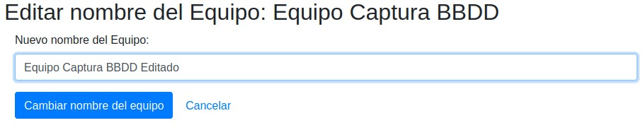

# Documentación #

## Introducción ##
En esta documentación se mostrarán algunos detalles de las historias de usuario 009 y 010.

## Pantalla de la base de datos MySQL ##

Para esta práctica se ha utilizado una base de datos MySQL en un contenedor docker.

Bueno, realmente se han usado dos bases de datos, una para la ejecucuión y otra para los test.

En la siguiente imagen se puede ver como hemos cambiado de docker en activo para poder usar la base de datos de ejecución y, así poder realizar las capturas más comodamentes:


Ahora crearemos un nuevo equipo:


Y comprobaremos si se ha actualizado la base de datos. Usando el software MySQL Workbench:


Una vez creado el equipo correctamente, vamos a unirnos a él:


Y comprobar que, efectivamente, se ha realizado la relación en la base de datos (en la tabla "equipo_usuario"):


Bien, ahora vamos a cambiar el nombre del equipo, para ver si se refleja en la base de datos:



Recargamos la base de datos y vemos que ha cambiado el nombre:


Por último, eliminaremos el equipo, la otra función también exclusiva del administrador (con quien estamos logueados):


Y veremos si esto tiene su reflejo en la base de datos:


Y en la relación entre equipo y usuario


Con esto ha quedado contatado el buen funcionamiento de la base de datos y de las funciones implementadas para esta práctica.

## Listado de nuevas clases y métodos implementados ##
Las nuevas funciones implementadas en la clase **EquipoService**, creada previamente en la historia 008, son:

```java
@Transactional
    public Equipo nuevoEquipo(String tituloEquipo){
        Equipo equipo = new Equipo(tituloEquipo);
        equipoRepository.save(equipo);
        return equipo;
    }
```
Que crea un nuevo equipo en la BD con el nombre indicado.
```java
@Transactional(readOnly = true)
    public Boolean usuarioPerteneceAEquipo(Long idUsuario, Long idEquipo){

        Equipo equipo = equipoRepository.findById(idEquipo).orElse(null);
        if (equipo == null){
            throw new EquipoServiceException("Equipo " + idEquipo + " no existe ");
        }

        Usuario usuario = usuarioRepository.findById(idUsuario).orElse(null);
        if (usuario == null) {
            throw new UsuarioServiceException("Usuario " + idUsuario + " no existe ");
        }

        List<Usuario> usuarios = usuariosEquipo(idEquipo);
         return  usuarios.contains(usuario);
    }
```
Se trata de una función auxiliar que comprueba la existencia de un usuario, un equipo y relación entre ambos.
```java
@Transactional
    public Boolean anyadirUsuarioAEquipo(Long idUsuario, Long idEquipo){

        Boolean anyadido = false;


        if (!usuarioPerteneceAEquipo(idUsuario, idEquipo)){
            Equipo equipo = equipoRepository.findById(idEquipo).orElse(null);

            Usuario usuario = usuarioRepository.findById(idUsuario).orElse(null);

            equipo.getUsuarios().add(usuario);
            usuario.getEquipos().add(equipo);
            anyadido = true;
        }
        return anyadido;
    }
```
Que crea la relación entre el usuario y el equipo indicados.
```java
@Transactional
    public Boolean eliminarUsuarioDeEquipo(Long idUsuario, Long idEquipo){

        Boolean eliminado = false;

        if (usuarioPerteneceAEquipo(idUsuario, idEquipo)){
            Equipo equipo = equipoRepository.findById(idEquipo).orElse(null);

            Usuario usuario = usuarioRepository.findById(idUsuario).orElse(null);

            equipo.getUsuarios().remove(usuario);
            usuario.getEquipos().remove(equipo);
            eliminado = true;
        }

        return eliminado;
    }
```
Que desvincula al usuario indicado del equipo indicado.

Para la historia 010 se añadieron las siguientes funciones:
```java
@Transactional
    public void eliminarEquipo(Long idEquipo){

        Equipo equipo = equipoRepository.findById(idEquipo).orElse(null);
        if (equipo == null){
            throw new EquipoServiceException("Equipo " + idEquipo + " no existe ");
        }

        equipo.getUsuarios().removeAll(usuariosEquipo(idEquipo));

        equipoRepository.delete(equipo);

    }
```
Elimina, primero los usuarios del equipo, y luego el equipo de la BD.
```java
@Transactional
    public Equipo editarNombreEquipo(Long idEquipo, String nuevoNombre){

        Equipo equipo = equipoRepository.findById(idEquipo).orElse(null);
        if (equipo == null){
            throw new EquipoServiceException("Equipo " + idEquipo + " no existe ");
        }
        equipo.setNombre(nuevoNombre);
        equipoRepository.save(equipo);

        return equipo;
    }
```
Actualiza el nombre del equipo indicado.

Los módulos nuevos en la clase **EquipoController**, a partir de la historia 009, son los siguientes:
```java
@GetMapping("/equipos/nuevo")
    public String formNuevoEquipo(@ModelAttribute Equipo equipo, Model model, HttpSession session){

        managerUserSesion.usuarioLogueado(session);
        Usuario usuario = usuarioService.findById((Long)session.getAttribute("idUsuarioLogeado"));
        if (usuario == null) {
            throw new UsuarioNotFoundException();
        }
        model.addAttribute("usuario", usuario);
        return "formNuevoEquipo";
    }
```
Que muestra el formulario para crear un nuevo equipo.
```java
@PostMapping("/equipos/nuevo")
    public String nuevoEquipo(@ModelAttribute Equipo equipo, Model model, RedirectAttributes flash,
                              HttpSession session){

        managerUserSesion.usuarioLogueado(session);
        Usuario usuario = usuarioService.findById((Long)session.getAttribute("idUsuarioLogeado"));
        if (usuario == null) {
            throw new UsuarioNotFoundException();
        }
        equipoService.nuevoEquipo(equipo.getNombre());
        flash.addFlashAttribute("mensaje", "Equipo creada correctamente");
        return "redirect:/equipos";
    }
```
Que añade a la BD el nuevo equipo con los datos introducidos en el formulario.
```java
@PostMapping("/equipos/{id}")
    public String unirmeAEquipo(@PathVariable(value="id") Long idEquipo,Model model,
                                RedirectAttributes flash, HttpSession session){
        managerUserSesion.usuarioLogueado(session);
        Usuario usuario = usuarioService.findById((Long)session.getAttribute("idUsuarioLogeado"));
        if (usuario == null) {
            throw new UsuarioNotFoundException();
        }
        if (equipoService.anyadirUsuarioAEquipo(usuario.getId(), idEquipo)){
            flash.addFlashAttribute("mensaje", "Te has unido al equipo correctamente");
        }
        else flash.addFlashAttribute("mensaje", "Error al unirse al equipo");
        return "redirect:/equipos/" + idEquipo;
    }
```
Que mete al usuario logueado en el equipo indicado en la URL.
```java
@PostMapping("/equipos/{id}/salir")
    public String salirDeEquipo(@PathVariable(value="id") Long idEquipo,Model model,
                                RedirectAttributes flash, HttpSession session){
        managerUserSesion.usuarioLogueado(session);
        Usuario usuario = usuarioService.findById((Long)session.getAttribute("idUsuarioLogeado"));
        if (usuario == null) {
            throw new UsuarioNotFoundException();
        }
        if (equipoService.eliminarUsuarioDeEquipo(usuario.getId(), idEquipo)){
            flash.addFlashAttribute("mensaje", "Has dejado el equipo");
        }
        else flash.addFlashAttribute("mensaje", "Error al dejar el equipo");
        return "redirect:/equipos/" + idEquipo;
    }
```
Post que saca al usuario logueado del equipo de la URL. Elimina la relación en la BD.

Las funciones añadidas para la historia 010 son:
```java
@GetMapping("/equipos/{id}/editar")
    public String mostrarFormNuevoEquipo(@PathVariable(value="id") Long idEquipo, Model model, HttpSession session){

        managerUserSesion.usuarioLogueado(session);
        managerUserSesion.comprobarUsuarioAdministrador(session, (Boolean) session.getAttribute("administrador"));
        Usuario usuario = usuarioService.findById((Long)session.getAttribute("idUsuarioLogeado"));
        if (usuario == null) {
            throw new UsuarioNotFoundException();
        }
        model.addAttribute("usuario", usuario);

        Equipo equipo = equipoService.findById(idEquipo);
        model.addAttribute("equipo", equipo);

        return "formEditarEquipo";
    }
```
Muestra el formulario para cambiar el nombre del equipo.
```java
@PostMapping("/equipos/{id}/editar")
    public String formNuevoEquipo(@PathVariable(value="id") Long idEquipo, @ModelAttribute Equipo equipo,
                                  Model model, HttpSession session){
        managerUserSesion.usuarioLogueado(session);
        managerUserSesion.comprobarUsuarioAdministrador(session, (Boolean) session.getAttribute("administrador"));
        Usuario usuario = usuarioService.findById((Long)session.getAttribute("idUsuarioLogeado"));
        if (usuario == null) {
            throw new UsuarioNotFoundException();
        }

        equipoService.editarNombreEquipo(idEquipo, equipo.getNombre());

        return "redirect:/equipos";
    }
```
Post que actualiza el nombre del equipo en la URL.
```java
@PostMapping("/equipos/{id}/eliminar")
    public String eliminarEquipo(@PathVariable(value="id") Long idEquipo, Model model,
                                 RedirectAttributes flash, HttpSession session){

        managerUserSesion.usuarioLogueado(session);
        managerUserSesion.comprobarUsuarioAdministrador(session, (Boolean) session.getAttribute("administrador"));
        Usuario usuario = usuarioService.findById((Long)session.getAttribute("idUsuarioLogeado"));
        if (usuario == null) {
            throw new UsuarioNotFoundException();
        }

        equipoService.eliminarEquipo(idEquipo);
        flash.addFlashAttribute("mensaje", "Equipo eliminado");

        return "redirect:/equipos";
    }
```
Post para eliminar el equipo indicado en la URL.

## Listado de plantillas thymeleaf modificadas ##
Para la historia de usuario 008 se han añadido **listaEquipos** y **usuariosEquipo**, las plantillas añadidas después de la historia de usuario 008 han sido **formEditarEquipo** y **formNuevoEquipo**.

Se ha intentado seguir el modelo visto en las plantillas thymeleaf de otras listas como Tareas o Usuarios, tanto en los formularios como en las listas, por lo que no hay nada destacable a comentar.

Se ha añadido a **fragments** el enlace a la lista de Equipos.
```html
<li class="nav-item" >
                <a class="nav-link" href="/equipos">Equipos
                <span class="sr-only">(current)</span></a>
</li>
```

## Tests implementados ##
Se han añadido los siguientes test a **EquipoServiceTest**, creado en la historia 008:
```java
@Test
    @Transactional
    public void testNuevoEquipo(){
        // GIVEN
        // En el application.properties se cargan los datos de prueba del fichero datos-test.sql

        // WHEN
        Equipo equipo = equipoService.nuevoEquipo("EquipoTest");
        List<Equipo> equipos = equipoService.findAllOrderedByName();

        // THEN
        assertThat(equipos).hasSize(3);
        assertThat(equipos.get(0).getNombre()).isEqualTo("EquipoTest");
    }
```
```java
@Test
    @Transactional
    public void testAnyadirUsuarioANuevoEquipo(){
        // GIVEN
        // En el application.properties se cargan los datos de prueba del fichero datos-test.sql

        // WHEN
        Equipo equipo = equipoService.nuevoEquipo("EquipoTest");
        Usuario usuario = usuarioService.findById(1L);

        Boolean resultadoPrimeraOperacion = equipoService.anyadirUsuarioAEquipo(usuario.getId(), equipo.getId());
        //2a inserción, que no debe realizarse
        Boolean resultadoSegundaOperacion = equipoService.anyadirUsuarioAEquipo(usuario.getId(), equipo.getId());

        // THEN
        assertThat(resultadoPrimeraOperacion).isTrue();
        assertThat(resultadoSegundaOperacion).isFalse();
        assertThat(equipo.getUsuarios().size()).isEqualTo(1);
        assertThat(equipo.getUsuarios().contains(usuario));
        assertThat(usuario.getEquipos().contains(equipo));
    }
```
```java
@Test
    @Transactional
    public void testEliminarUsuarioDeEquipo(){
        // GIVEN
        // En el application.properties se cargan los datos de prueba del fichero datos-test.sql

        Equipo equipo = equipoService.findById(1L);
        Usuario usuario = usuarioService.findById(1L);

        assertThat(equipo.getUsuarios().size()).isEqualTo(1);
        assertThat(equipo.getUsuarios().contains(usuario));
        assertThat(usuario.getEquipos().contains(equipo));

        // WHEN

        Boolean resultadoPrimeraOperacion = equipoService.eliminarUsuarioDeEquipo(usuario.getId(), equipo.getId());
        //2o borrado, que no debe realizarse
        Boolean resultadoSegundaOperacion = equipoService.eliminarUsuarioDeEquipo(usuario.getId(), equipo.getId());

        // THEN
        assertThat(resultadoPrimeraOperacion).isTrue();
        assertThat(resultadoSegundaOperacion).isFalse();
        assertThat(equipo.getUsuarios().size()).isEqualTo(0);
        assertThat(!equipo.getUsuarios().contains(usuario));
        assertThat(!usuario.getEquipos().contains(equipo));
    }
```
Referente a la historia 010:
```java
@Test
    @Transactional
    public void testEliminarEquipo(){

        // GIVEN
        // En el application.properties se cargan los datos de prueba del fichero datos-test.sql

        Equipo equipo = equipoService.findById(1L);
        assertThat(equipoService.findAllOrderedByName().size()).isEqualTo(2);
        assertThat(equipoService.findAllOrderedByName().contains(equipo));

        // WHEN
        equipoService.eliminarEquipo(equipo.getId());


        // THEN
        assertThat(equipoService.findAllOrderedByName().size()).isEqualTo(1);
        assertThat(!equipoService.findAllOrderedByName().contains(equipo));
    }
```
```java
@Test
    @Transactional
    public void testCambiarNombreEquipo(){

        // GIVEN
        // En el application.properties se cargan los datos de prueba del fichero datos-test.sql
        Equipo equipo = equipoService.nuevoEquipo("EquipoTest");
        Long idEquipoAModificar = 1L;
        equipo.setId(idEquipoAModificar);

        // WHEN
        Equipo equipoNuevoNombre = equipoService.editarNombreEquipo(idEquipoAModificar, "EquipoTestNuevoNombre");
        Equipo equipoBD = equipoService.findById(idEquipoAModificar);

        // THEN
        assertThat(equipoNuevoNombre.getNombre()).isEqualTo("EquipoTestNuevoNombre");
        assertThat(equipoBD.getNombre()).isEqualTo("EquipoTestNuevoNombre");
    }
```
Y se ha creado la clase **EquipoWebTest** que comprueba los controllers mediante las vistas. Se ha hecho un test por cada función del controller:
Para la historia de usuario **008**:
```java
@Test
    public void testListaEquipos() throws Exception {
        Usuario usuario = new Usuario("andres@ua.es");
        usuario.setId(1L);

        List<Equipo> equipos = new ArrayList<>();
        Equipo equipo = new Equipo("Proyecto P1");
        equipos.add(equipo);

        when(usuarioService.findById(null)).thenReturn(usuario);
        when(equipoService.findAllOrderedByName()).thenReturn(equipos);

        this.mockMvc.perform(get("/equipos"))
                .andDo(print())
                .andExpect(content().string(containsString("Proyecto P1")));
    }
```
```java
@Test
    public void testListarUsuariosEquipo() throws Exception {
        Usuario usuario = new Usuario("andres@ua.es");
        usuario.setId(1L);
        usuario.setNombre("Andres Tebar");

        List<Usuario> usuarios = new ArrayList<>();
        usuarios.add(usuario);

        Equipo equipo = new Equipo("Proyecto P1");
        equipo.setId(1L);

        when(usuarioService.findById(null)).thenReturn(usuario);
        when(equipoService.findById(1L)).thenReturn(equipo);
        when(equipoService.usuariosEquipo(1L)).thenReturn(usuarios);

        this.mockMvc.perform(get("/equipos/1"))
                .andDo(print())
                .andExpect(content().string(containsString("Andres Tebar")));
    }
```
Para la historia de usuario **009**:
```java
@Test
    public void nuevoEquipoDevuelveForm() throws Exception {
        Usuario usuario = new Usuario("andres@ua.es");
        usuario.setId(1L);

        when(usuarioService.findById(null)).thenReturn(usuario);

        this.mockMvc.perform(get("/equipos/nuevo"))
                .andDo(print())
                .andExpect(content().string(containsString("Nuevo Equipo")));
    }
```
```java
@Test
    public void crearNuevoEquipo() throws Exception {
        Usuario usuario = new Usuario("andres@ua.es");
        usuario.setId(1L);

        when(usuarioService.findById(null)).thenReturn(usuario);

        this.mockMvc.perform(post("/equipos/nuevo")
                .param("Nombre", "EquipoTest"))
                .andDo(print())
                .andExpect(status().is3xxRedirection())
                .andExpect(redirectedUrl("/equipos"));

    }
```
```java
@Test
    public void testUnirseAEquipo() throws Exception {

        Usuario usuario = new Usuario("andres@ua.es");
        usuario.setId(1L);

        Equipo equipo = new Equipo("Proyecto P1");
        equipo.setId(1L);

        when(usuarioService.findById(null)).thenReturn(usuario);
        when(equipoService.anyadirUsuarioAEquipo(1L, 1L)).thenReturn(true);

        this.mockMvc.perform(post("/equipos/1"))
                .andDo(print())
                .andExpect(status().is3xxRedirection())
                .andExpect(redirectedUrl("/equipos/1"));
    }
```
```java
@Test
    public void testSalirDeEquipo() throws Exception {

        Usuario usuario = new Usuario("andres@ua.es");
        usuario.setId(1L);

        Equipo equipo = new Equipo("Proyecto P1");
        equipo.setId(1L);

        when(usuarioService.findById(null)).thenReturn(usuario);
        when(equipoService.eliminarUsuarioDeEquipo(1L, 1L)).thenReturn(true);

        this.mockMvc.perform(post("/equipos/1/salir"))
                .andDo(print())
                .andExpect(status().is3xxRedirection())
                .andExpect(redirectedUrl("/equipos/1"));
    }
```
Para la historia de usuario **010**:
```java
@Test
    public void testMostrarEditarForm() throws Exception{
        Usuario usuario = new Usuario("andres@ua.es");
        usuario.setId(1L);
        usuario.setAdministrador(true);

        Equipo equipo = new Equipo("EquipoTest");
        equipo.setId(1L);

        when(usuarioService.findById(null)).thenReturn(usuario);
        when(equipoService.findById(1L)).thenReturn(equipo);

        this.mockMvc.perform(get("/equipos/1/editar"))
                .andDo(print())
                .andExpect(content().string(containsString("Editar nombre del Equipo: EquipoTest")));

    }
```
```java
@Test
    public void testEditarEquipo() throws Exception{

        Usuario usuario = new Usuario("andres@ua.es");
        usuario.setId(1L);
        usuario.setAdministrador(true);

        Equipo equipo = new Equipo("EquipoTest");
        equipo.setId(1L);

        when(usuarioService.findById(null)).thenReturn(usuario);

        this.mockMvc.perform(post("/equipos/1/editar"))
                .andDo(print())
                .andExpect(status().is3xxRedirection())
                .andExpect(redirectedUrl("/equipos"));
    }
```
```java
@Test
    public void testEliminarEquipo() throws Exception{

        Usuario usuario = new Usuario("andres@ua.es");
        usuario.setId(1L);
        usuario.setAdministrador(true);

        Equipo equipo = new Equipo("EquipoTest");
        equipo.setId(1L);

        when(usuarioService.findById(null)).thenReturn(usuario);

        this.mockMvc.perform(post("/equipos/1/eliminar"))
                .andDo(print())
                .andExpect(status().is3xxRedirection())
                .andExpect(redirectedUrl("/equipos"));
    }
```


## Fragmentos de código fuente interesante ##
Al ser unas funciones bastante parecidas a las ya implementadas en la práctica anterior no hay fragmentos dignos de comentar.

Quizás destacar que, sin ser necesario pero sí recomendable, se han añadido mutuamente usuario a equipo y viceversa para su relación establecida en la parte guiada de la historia 008.
```java
equipo.getUsuarios().add(usuario);
usuario.getEquipos().add(equipo);
```
